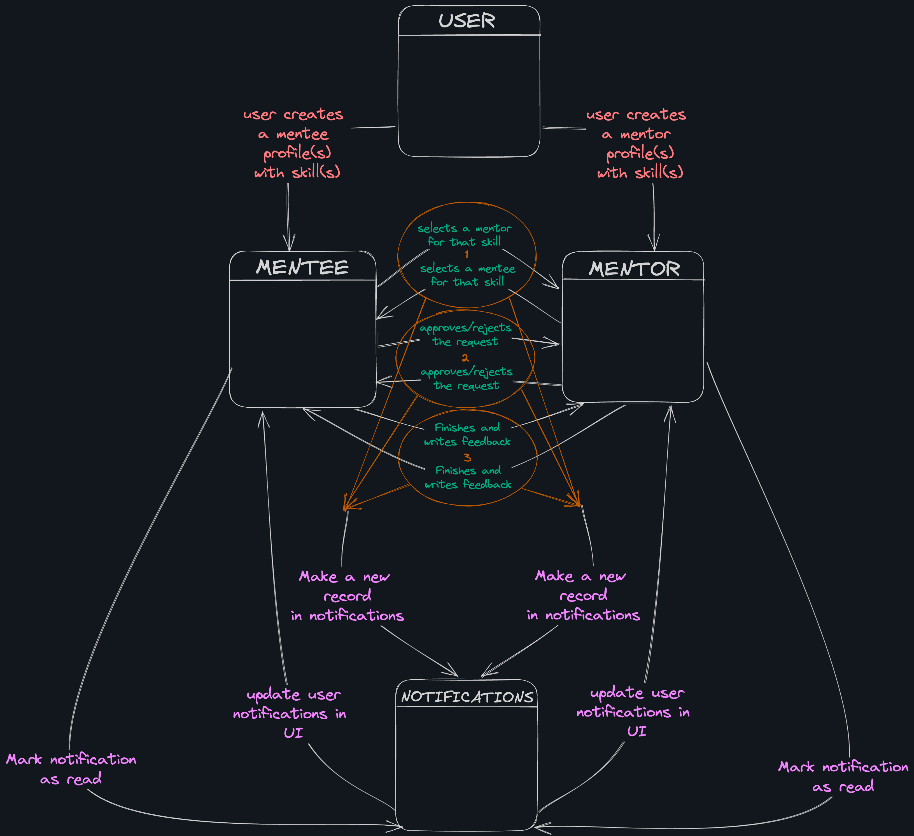

# Guruva

## An attempt to create a mentor finding platform for all tech enthusiasts

### Plan for flow

### To run the project

Add `--add-opens java.base/java.time=ALL-UNNAMED` to VM options in run configuration

### Access Postman Collection for latest API updates

[//]: # (Getters and Updaters of User, Mentor and Mentee, following exception handling & best practices)
[//]: # (Add a new Rating document class)
[//]: # (Notification system for Mentee and Mentor)
